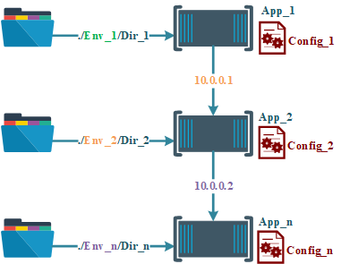
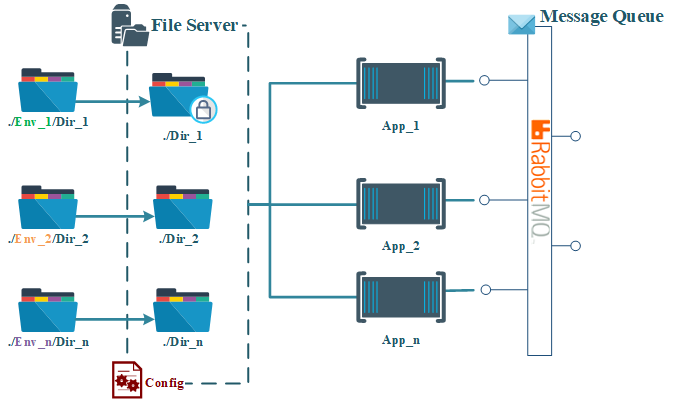

# Deployment Walkthrough: Microservice Interface Hosts
The purpose of this article is to walkthrough the setting up of infrastructure for containerized applications to communicate and access files.  Containerizing an application gives great flexibility in how, where, and at what scale it’s deployed. A drawback to this versatility is the problem of discoverability. Microservice applications often rely on accessing remote files and the ability to communicate with other apps. How does an app find these resources when being deployed into different data centers and dynamicly assign IP addresses?

## Hard Coded Solution: Configuration files
One way to resolve this is to collect all of these environment differences into a configuration file. A new config. file is needed per deployment environment and app. This solution is straight forward but has a significant maintenance cost as the number of apps increases or reused in multiple locations. 



**Diagram 1-1: Direct hard coded addressing**

## Generalized Solution: Communication Interfaces
A solution for generalized deployment scenarios is to deploy containerizes that can interface between the microservices and the environments they're deployed into. Interfaces deployed as containers are instantly discoverable to other apps in the same Docker “network”[add link to Docker Network Doc].can be natively discovered by the individual applications they will be serving. 
The general concept is to utilize an sftp server and a messaging queue to provide applications with file access and intra-app communication, respectfully. This simplifies maintenance by focusing deployment specific configurations to a single interface.



**Diagram 1-2: Communication Interface**

--------------------------------------------------
## SFTP Server
An sftp file server allows for applications to securely access files from a directory addressed on the file server but stored physically somewhere else. The advantages of accessing files through a server is that extremely complex or changing network mappings can be statically addressed by an app.

The below example uses the [atmoz sftp image](https://github.com/atmoz/sftp) to create a file server with 2 directories. The first directory points to ```/mnt/d/GenStore/sample-data-set/survey-results``` on the host machine. On the file server this address becomes ```/home/admin/upload/raw```. Likewise the second directory appears under the same parent even though it's location on the host is on a different drive. In addition the ```ro``` suffix makes the first directory read only, very useful when safe guarding sourcing files from alteration. 

```yaml
version: '2'

services:
  sftp-server:
    image: atmoz/sftp
    volumes:
        - /mnt/d/GenStore/sample-data-set/survey-results:/home/admin/upload/raw:ro
        - /mnt/f/dept010/data-store/1mk3f5-e5ltb4-4r56yh/01/02:/home/admin/upload/weather-set
    ports:
        - "22:22"
    networks:
      - ddec-pipeline-network
    command: admin:pass:1001
```


## Messaging Queue
Messaging queues are standard design concepts for microservice applications. Queues allow for applications to be “loosely” connected. Meaning, that each app communicates with the queue instead of with each other. A message queue, in a way, is a running list of small messages. Messages are posted by one app (publishers) and then read by another (subscribers). This example uses an image created by RabbitMQ. RabbitMQ makes connectors for lots of different languages and is efficient for general purpose use cases.
Below is the docker-compose yaml for deploying the RabbitMQ broker. 

```yaml
version: '2'

services:
  rabbit-queue:
    image: rabbitmq:3-management
    hostname: rabbit-1
    environment:
      - RABBITMQ_ERLANG_COOKIE='FIDATKey_Link_k1'
    ports:
      - '15672:15672'
      - '5672:5672'
    networks:
      - ddec-pipeline-network
```

You can follow a detailed “Hello World” walkthrough in your language of choice from the [RabbitMQ site](https://www.rabbitmq.com/tutorials/tutorial-one-python.html). Below are simple python scripts for a publisher and a subscriber.
<publisher-script>
<subscriber-script>

## Complete Script
```yaml
version: '2'

services:
  sftp-srv:
    image: atmoz/sftp
    volumes:
        - /mnt/d/GenStore/sample-data-set/survey-results:/home/admin/upload/raw:ro
        - /mnt/f/dept010/data-store/1mk3f5-e5ltb4-4r56yh/01/02:/home/admin/upload/weather-set
    ports:
        - "22:22"
    networks:
      - ddec-pipeline-network
    command: admin:pass:1001
  
  rabbit-queue:
    image: rabbitmq:3-management
    hostname: rabbit-1
    environment:
      - RABBITMQ_ERLANG_COOKIE='FIDATKey_Link_k1'
    ports:
      - '15672:15672'
      - '5672:5672'
    networks:
      - ddec-pipeline-network
networks:
  ddec-pipeline-network:
    external: true
``` 
***Interface hosts*** [*docker-compose.yaml*](../assets/2021-02-08/docker-compose.yml)

