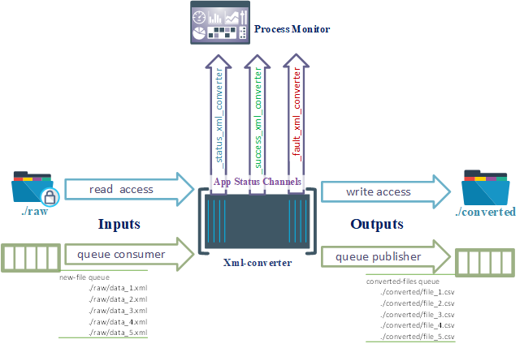

# Docker Template: Python App Looped Execution
## Overview
This article describes a template for executing a containerized python application with custom "microservice interfaces" enabled. Reference my previous post [Deployment Walkthrough: Microservice Communication Interface](../2021-02-08-Microservice-Interface-Hosts.md) for details about interface hosts. This template is suitable for both batch and always-on use cases. Project

## Template Components
[*Project repo: project-templates*](https://github.com/DarrylBrysonDev0/project-templates/tree/main/Docker/Python/python-app-loop) 
- Docker stack file (docker-compose)
  - [Docker Image](https://github.com/DarrylBrysonDev0/project-templates/blob/main/Docker/Python/python-app-loop/app-image/Dockerfile.python-app-loop)
  - [docker-compose (deployment)](https://github.com/DarrylBrysonDev0/project-templates/blob/main/Docker/Python/python-app-loop/docker-compose.python-app-loop.yml)
- Interface Classes
  - [SFTP Server](https://github.com/DarrylBrysonDev0/project-templates/blob/main/Docker/Python/microservice-interface-class-information.md)
  - [Messaging Queue](https://github.com/DarrylBrysonDev0/project-templates/blob/main/Docker/Python/microservice-interface-class-information.md)
- Python app
  - [requirements.txt](https://github.com/DarrylBrysonDev0/project-templates/blob/main/Docker/Python/python-app-loop/app-image/requirements.txt)
  - [Script Boilerplate](https://github.com/DarrylBrysonDev0/project-templates/blob/main/Docker/Python/python-app-loop/app-image/python-app-loop.py)

## Template Concept
This template adds, to a python container, several libraries and boiler-plating to support the development of microservice applications. Included are classes that can interface between the microservices and the environments they're deployed into. The interface provides 3 types of communication channels.
1. Inputs
2. Outputs
3. Status    

*Diagram 1-1: View of container communication interface*
### Input Channels
Inbound communication interfaces for the application to use as source data. Input channels include:

* `SOURCE_PATH`: Source SFTP directory of input files. Default: **/src**.
* `INPUT_QUEUE`: Queue to use as an input channel of messages. Default: **new_files**.

### Outputs Channels
Outbound communication interfaces for the application to export result data. Output channels include:

* `DEST_PATH`: Output SFTP directory of result files. Default: **/trgt**.
* `OUTPUT_QUEUE`: Queue to use as an output channel of messages. Default: **processed_files**.

### Status
* `NAMESPACE`: Base name to use for reporting container status. Default: ***uuid***.
  * `_success_<NAMESPACE>`: Reports successful completion of an application cycle or task
  * `_fault_<NAMESPACE>`: Reports fault of application task
  * `_status_<NAMESPACE>`: Reports ongoing progress of application

## Example Use Case

*Diagram 1-2: Example File Conversion Use Case*

A typical task in many data solutions is the bulk conversion of files. The above diagram illustrates how this template can containerize a python script for xml conversion.The `INPUT_QUEUE =  new-files` holds a list of files that need to be converted. Those files are then accessed through the `SOURCE_PATH = ./raw`. After the conversion is complete the resulting file is uploaded to `DEST_PATH = ./converted` and the save path is published to `OUTPUT_QUEUE = converted-files` this will be the input queue for next task.

As the task is running progression is reported on queue `_status_xml_converter`. Any files that fail conversion will be reported to `_fault_xml_converter`. Finally, each successful completion of a task cycle, controlled by `FREQUENCY_SEC`, will report to queue `_success_xml_converter`.